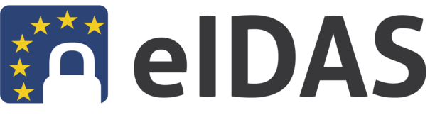

# **eIDAS**

## **Introduzione**

Il regolamento (UE) n. 910/2014, noto come **eIDAS** (*electronic IDentification, Authentication and trust Services*), stabilisce le regole per l’identificazione elettronica e i servizi fiduciari per le transazioni elettroniche nel mercato unico europeo.  
L’obiettivo è garantire l’interoperabilità dei sistemi nazionali di identificazione elettronica, permettendo a cittadini e imprese di accedere ai servizi online pubblici e privati in tutta l’UE con credenziali sicure e riconosciute.

## **Livelli di autenticazione eIDAS**

Il regolamento definisce tre livelli di garanzia:

- **eIDAS 1 – Basso**  
  Identificazione tramite credenziali semplici (es. username e password).  
  Garantisce un livello base di affidabilità.

- **eIDAS 2 – Sostanziale**  
  Identificazione tramite autenticazione a più fattori (es. password + OTP, PIN o strumenti equivalenti).  
  Offre maggiore sicurezza contro accessi non autorizzati.

- **eIDAS 3 – Elevato**  
  Identificazione con dispositivi di sicurezza avanzati (es. smartcard, token crittografici, dispositivi PKI).  
  Assicura il massimo livello di protezione.

La scelta del livello minimo richiesto per l’accesso ai servizi è a carico dell’ente erogatore e viene impostata tra i **parametri della richiesta di autenticazione**. Se l’utente presenta un livello inferiore rispetto a quello richiesto, l’accesso viene negato.

## **eIDAS e CohesionID**

All’interno della piattaforma **CohesionID**, l’uso del parametro `eidas` consente di abilitare o meno l’autenticazione tramite nodo eIDAS, definendo anche le modalità di gestione del codice fiscale:

- `eidas=1` → login eIDAS abilitato, **senza verifica del Codice Fiscale**;  
- `eidas=2` → login eIDAS abilitato con **verifica semplice del Codice Fiscale**;  
- `eidas=3` → login eIDAS abilitato con **verifica forte del Codice Fiscale**.

In generale, per gli utenti esteri autenticati tramite nodo eIDAS, il **Codice Fiscale non è previsto come attributo**.  
Il sistema trasmette sempre un identificativo univoco europeo (`personIdentifier`) e, se disponibili, i dati anagrafici di base:

- nome  
- cognome  
- data di nascita  

Queste informazioni garantiscono la corretta identificazione transfrontaliera senza imporre l’obbligo del codice fiscale, previsto solo in Italia.

## **Relazione con i livelli di accesso**

I livelli eIDAS corrispondono ai **Level of Assurance (LoA)** riconosciuti anche da SPID e CIE.  
In CohesionID, un servizio può quindi richiedere:

- **LoA2 / eIDAS 1** → autenticazione base (password o CIE L1);  
- **LoA3 / eIDAS 2** → autenticazione più forte (SPID L2, CIE L2, OTP, smartcard);  
- **LoA4 / eIDAS 3** → autenticazione con dispositivi crittografici o certificati (CIE L3, CNS, token PKI).

Grazie a questa interoperabilità, CohesionID permette di integrare **utenze italiane e transfrontaliere**, applicando regole di sicurezza omogenee e conformi al regolamento europeo.

---
